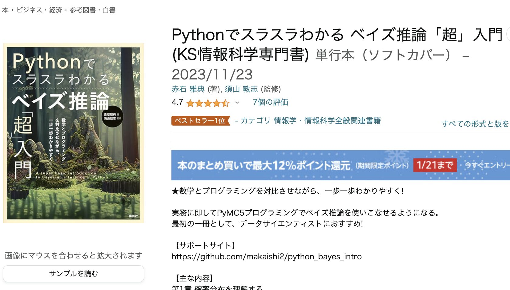
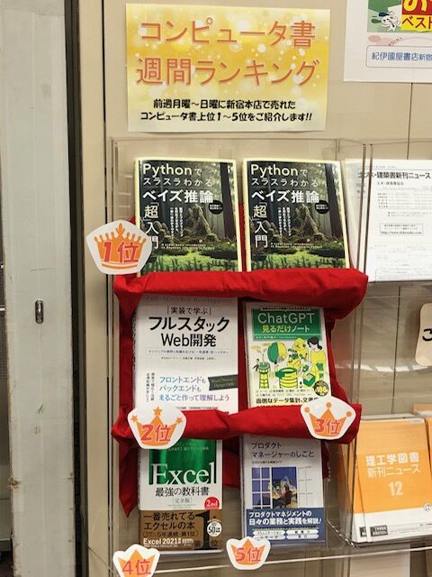
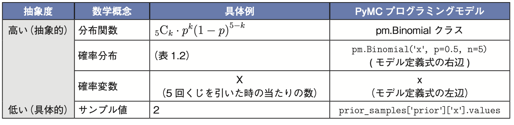
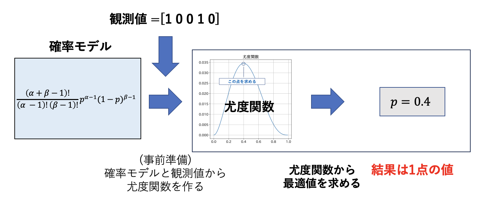

# 書籍『Pythonでスラスラわかる ベイズ推論「超」入門』サポートサイト

　当サイトは 、書籍『**Pythonでスラスラわかる ベイズ推論「超」入門**』のサポートサイトです。  　ベイズ推論理解のためには、確率分布などの数学知識が必須です。本書であれば、数学知識が不十分な読者も、Python実習を通じて簡単にベイス推論が理解できます。

##   宣伝
### 講演会のビデオがYoutubeで公開されています
2024年3月25日(月)に実施されたデータサイエンティスト協会主催の『ベイズ推論』webセミナーの講演内容が下記リンク先から公開されています。
https://www.youtube.com/watch?v=ex119MhbyCk

### おかげさまで大変好評です

|ジャンル|順位|写真|
|---|---|---|
|アマゾンカテゴリ別(情報学・情報科学全般)|1位||
|紀伊國屋新宿本店　週間IT書籍ランキング|1位||
|東大生協 本郷書籍部 ベストセラー  |4位||

## Amazonへのリンク

[単行本](https://www.amazon.co.jp/dp/4065337631) 

[Kindle版](https://www.amazon.co.jp/dp/B0CP26YYRJ)
 

## 実習Notebookリンク
　本書の実習コードは、Google Colabで動かすことを前提に、すべてGithub(当サポートサイト)で公開しています。  

[実習Notebook一覧](https://github.com/makaishi2/python_bayes_intro/tree/main/notebooks)

[実習Notebookの動かし方](refs/how-to-run.md) 

[参考Notebook](https://github.com/makaishi2/python_bayes_intro/tree/main/sample-notebooks)

 

## 本書の特徴

* ベイズ推論でモデルを構築する上で必須の数学概念である確率分布の初歩を、オブジェクト指向プログラミングモデルと対比しながら理解できるようになります

* PyMCとArVizの使い方を一歩一歩学べます

* 「くじ引きを5回引いた結果からくじの当たる確率を類推する」という簡単な題材を例にして、ベイズ推論の考え方を理解できます

* 「正規分布の平均・標準偏差を推論する」というシンプルな問題から「潜在変数モデル」という高度な問題までさまざまなベイズ推論の仕組みを、実習プログラムを通じて理解できます

* ABテストや線形回帰モデルの効果検証など、業務観点でのベイズ推論活用事例を学ぶことができます

* 各章・節の最後のコラムで、「事前分布と事後分布の違い」「HDIとCIの違い」や、「target_acceptによるチューニング」「変分推論法の利用」など、知っておくと役に立つ、やや高度な概念や手法を理解できます

## 本書の想定読者

　本書では、scikit-learnなどのライブラリを利用する**普通の機械学習はマスターした上で**、**次のステップでベイズ推論を学習したい**という読者の方を主に想定しています。 　プログラミングとの類推を活用して確率などの数学を説明する部分もあるので、**ある程度のPythonプログラミングスキルは前提**としています。具体的な知識レベルは以下のとおりです。

* Python文法の基礎知識

  - 整数型、浮動小数点数型、ブーリアン型などの基本型

  - 関数呼び出しにおけるオプション付き引数

  - オブジェクト指向プログラミングの基礎概念(クラス、インスタンス、コンストラクタ)

* NumPy, pandas, matplotlib, Seabornの基本的な操作

　数学に関しては、極力、**高校１年程度の数学知識で読み進めることができる**よう心がけました。確率分布の説明などで、数式が出てくる箇所もありますが、数式をスルーしても先に読み進められるよう工夫したつもりです。 　逆に Pythonコードと数学概念との対応はとても重視しているので、読者の方には極力、本書の前提である**Google Colabで実習コードをを動かしながら本書をを読み進めていただく**ことを推奨いたします。

## 目次

[目次リンク](refs/目次.md)

## 本書ハイライト紹介

#### 確率分布関連の数学概念はオブジェクト指向プログラミングモデルとの対比で説明

　ベイズ推論モデル理解における最大のハードルである確率分布の数学概念に関しては、オブジェクト指向プログラミングモデルとの対比により、具体的イメージを持ちやすくしました。

#### 確率モデル定義に関しては可視化結果で詳しく解説

　ベイズ推論開発の根幹である確率モデル定義に関しては、すべての例題で可視化結果をつけ、この図を使って詳しく解説をしています。

#### ベイズ推論のステップをわかりやすく解説

　ベイズ推論における４つのステップを、利用するラブラリとの関連を含めてわかりやすく解説しています。

#### ベイズ推論の仕組みについては最尤推定との対比で説明

　ベイズ推定の仕組みについては、別の統計分析手法である最尤推定との対比で、何がどう違うのかをわかりやすく解説します。

#### 潜在変数モデル

　ベイズ推論の中でとても面白い、しかし難易度の高い潜在変数モデルについても例題に含めました。実データを用いて潜在変数モデルを開発する際のツボも、コラムで解説しています。

#### 実業務利用例

　６章では、すぐに業務で使えそうな利用例を掲載しています。この章を読むことで、実業務での利用イメージを持つことが可能です。

 

## その他解説記事

|ソース  |タイトルとリンク  |補足|
|---|---|---|
|qiita|[Amazonレビュー分析](https://qiita.com/makaishi2/items/074c803de4368ef7874f)|アマゾンのレビューは5から1までのスコア値を持っており平均スコア値をベイズ推論することは多項分布のいい例題になります。著者自身の7冊の本のスコアを題材にこのテーマでベイズ推論をしてみた事例です。|
|当サポートサイト|[3クラス潜在変数モデル](refs/3クラス潜在変数モデル.pdf)|5.4節　潜在変数モデルは対象を3クラスに拡張可能です。その解説をしています。|
|qiita|[潜在変数モデル補足](https://qiita.com/makaishi2/items/8dae04e51a79ae456995)|5.4節　潜在変数モデルの「ラベルスイッチ」について詳しく解説しました。|
|qiita|[潜在変数モデル簡易版](https://qiita.com/makaishi2/items/2ce59c2562537b92f383)|5.4節の潜在変数モデルは複数の推論タスクを同時に行う非常に複雑な確率モデルです。この確率モデルをよく理解するためには、カテゴリ比率pを固定値とした簡易版を用いるといいことがわかったため、この点をqiita記事で詳しく説明しました。|
|qiita|[Colab上のPyMC5をGPUで動かす](https://qiita.com/makaishi2/items/6247e80006b341216df8)|本書の実習の中でも6.3節の実習は特にサンプリングに時間がかかります。対策としてColabのGPUが使えることがわかり、その手順を解説しました。|

## リンク集

### 著者発信の情報

|ソース  |タイトルとリンク  |補足|
|---|---|---|
|twitter|[@makaishi2](https://twitter.com/makaishi2)|著者のツイッターアカウント。書籍に関連した情報発信とretweetが中心です。|
|異業種データサイエンス研究会招待講演資料|[AI・DS領域を学習したい方に向けて](https://speakerdeck.com/makaishi2/aidsling-yu-woxue-xi-sitaifang-nixiang-kete)|2022-12-03に異業種データサイエンス研究会主催で行われたイベントでの招講演資料です。|

### 外部リンク

|ソース  |タイトルとリンク  |補足|
|---|---|---|
|Amazon|[Amazonレビュー](https://www.amazon.co.jp/product-reviews/4065337631/)||
|togetterまとめサイト|https://togetter.com/li/2274456 |有名ブロガーのkenkenさんの本書へのコメントがまとめられています|

***

## 正誤訂正・FAQ

* [正誤訂正](refs/errors.md)

* [FAQ](refs/faqs.md)

