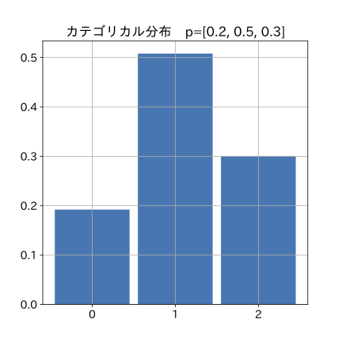
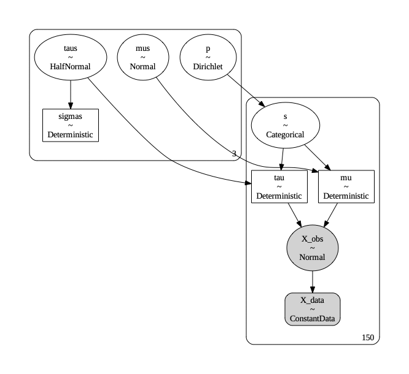
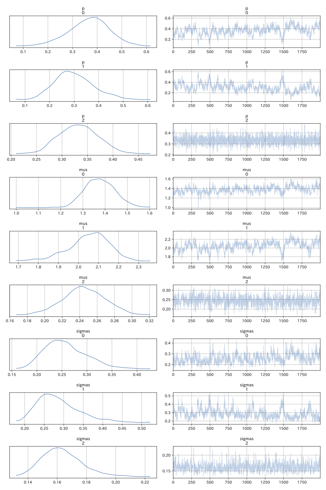
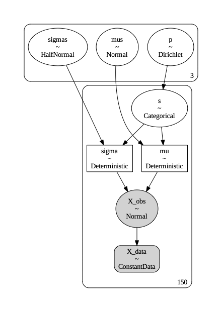
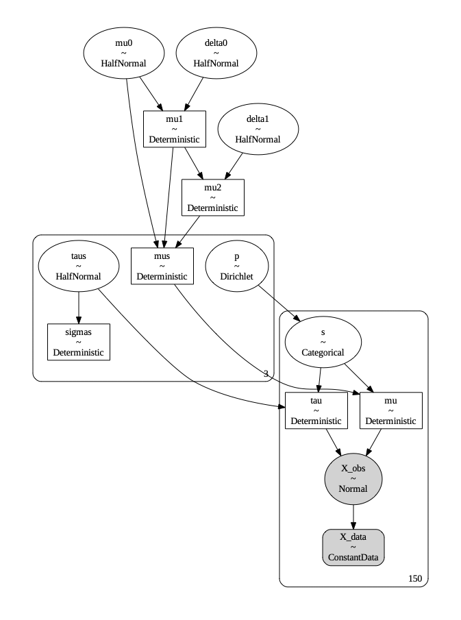
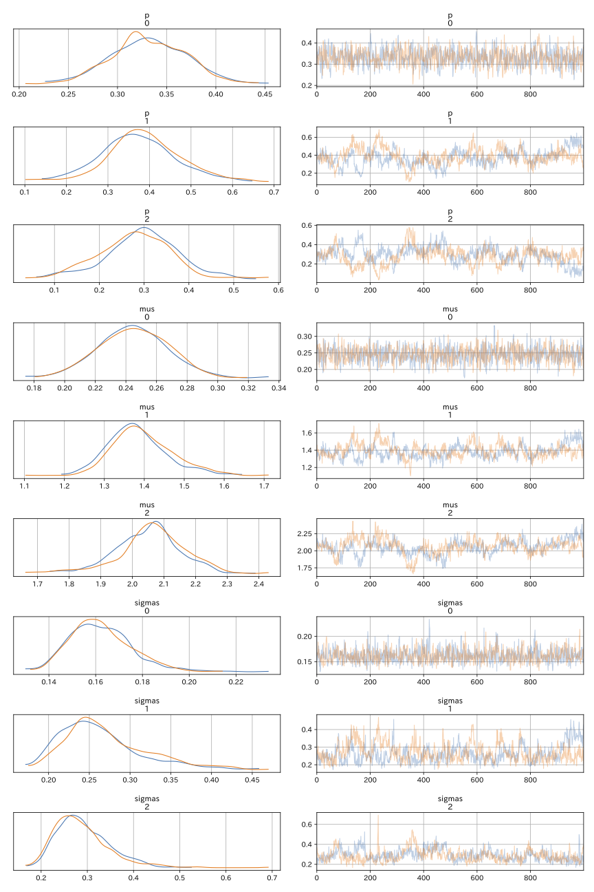
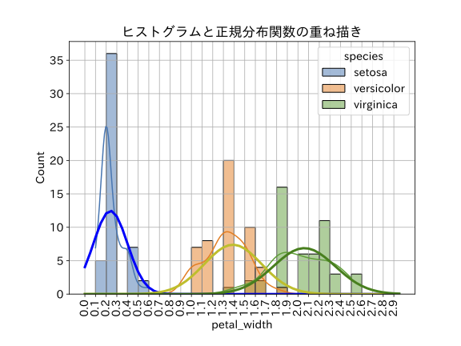

##  付録　3クラス潜在変数モデル

　5.4節ではアイリス・データセットを用いて潜在変数モデルのベイス推論をおこないましたが、この時は元々3種類ある花の種類を2種類に減らしてベイス推論をおこないました。3種類の花に対する潜在変数モデルを作れなかった理由は、確率モデル構築で必要な確率分布が2章で紹介したものでは足りなかったことによります。

　そこで当付録では、まず、3クラス潜在変数モデルで必要になる２つの確率分布である**カテゴリカル分布**と**ディリクレ分布**に関して、2章と同じ形式で紹介します。最後に、この２つの確率分布を利用した**3クラス潜在変数モデルの実習コードを示す**ことにします。


### A.1  カテゴリカル分布

#### 対応する事象

　2.1節で説明したとおり、確率変数値として**0, 1の2値の値を取る事象がベルヌーイ分布**でした。

　この考えを拡張すると、**確率変数値として0, 1, 2の3値を取る分布**も考えることが可能です。3以上のN個の整数値を観測値として取ることができる確率分布を**カテゴリカル分布**と呼びます。

　具体的な事例としては、


0: 凶

1: 吉

2: 大吉


の3種類の結果が返ってくるおみくじのようなものが考えられます。


####   確率分布を示す数式

　以下の説明はやや煩雑な数式になるので、数学が苦手な読者はスキップしてもらっていいです。

　カテゴリカル分布を示す数式は、2.1節で説明したベルヌーイ分布を示す数式$\ref{2.1.1}$を拡張したものとなります。


$$
P(X=k) = p^k \cdot (1-p)^{1-k}\label{2.1.1}\tag{2.1.1}
$$


　まず、分布の特性を規定する確率値ですが、上のおみくじの場合を例に取ると


$p_0$: 凶の出る確率

$p_1$: 吉の出る確率

$p_2$: 大吉の出る確率


の３つで表現することにします。

　おみくじは必ずこの３種類のどれかなので、式$\ref{A.1.1}$が成り立ちます。

$$
p_0 + p_1 + p_2 = 1\label{A.1.1}\tag{A.1.1}
$$
 

　次に確率変数$\mathrm{x}$を式$\ref{A.1.2}$のような３次元ベクトルで表現することとします。[^A_1_1]


$$
\mathbf{x}(凶) = [1, 0, 0]\\
\mathbf{x}(吉) = [0, 1, 0]\\
\mathbf{x}(大吉) = [0, 0, 1]\label{A.1.2}\tag{A.1.2}
$$


[^A_1_1]:  機械学習を学んだことのある読者であれば「one hot encodingと同じ」という話で理解できると思います。


　3次元ベクトル$\mathbf{x}$を成分表示すると式$\ref{A.1.3}$のように表現できます。


$$
\mathbf{x} = [x_0, x_1, x_2]\label{A.1.3}\tag{A.1.3}
$$


　この時、カテゴリカル分布は、以下の式$\ref{A.1.4}$で表すことができます。


$$
p_0^{x_0}\cdot p_1^{x_1} \cdot p_2^{x_2}\label{A.1.4}\tag{A.1.4}
$$


　$\ref{A.1.2}$のそれぞれのケースで$\ref{A.1.4}$を計算してみます。

$p^0 = 1$、$p^1 = 1$であることに注意すると、$\ref{A.1.4}$の計算結果は次の式$\ref{A.1.5}$になることがわかります。

$$
\mathrm{x}(凶)の場合: p_0\\
\mathrm{x}(吉)の場合: p_1\\
\mathrm{x}(大吉)の場合: p_2\label{A.1.5}\tag{A.1.5}
$$


　ベルヌーイ分布の式と同じで、$\ref{A.1.4}$の式は、場合分けをすることなく$\ref{A.1.5}$と同じことを表現しているのです。


　更に確率値$p$についても、式$\ref{A.1.6}$でベクトル表現します。


$$
\mathrm{p} = [p_0, p_1, p_2]\label{A.1.6}\tag{A.1.6}
$$


この時、カテゴリカル分布は、式$\ref{A.1.7}$で表すことが可能になります。


$$
Cat(\mathrm{x}|\mathrm{p}) = \prod_{i=0}^{N-1}{p_i^{x_i}}\label{A.1.7}\tag{A.1.7}
$$
　ここで$N$はカテゴリ数(おみくじの例の場合$N=3$)です。

　数学記号$\prod$によって、かけ算を省略して表現しています。


####  実装コード

　コードA-1-1にカテゴリカル分布の確率モデル定義の実装を示します。


コード A-1-1 カテゴリカル分布の確率モデル定義

```python
# パラメータ設定
p = [0.2, 0.5, 0.3]

model = pm.Model()
with model:
    # pm.Categorical: カテゴリカル分布
    # p: 各要素の発生確率
    x = pm.Categorical('x', p=p)
```


　 8行目でカテゴリカル分布の確率変数を定義しています。

　ベルヌーイ分布の実装と非常に似ていますが、ベルヌーイ分布の時はパラメータ``p``は0から1までの値を取る数値でした。今回は3要素の配列となっており、そこがベルヌーイ分布との違いです。


　コードA-1-2に事前分布のサンプリングと、サンプル値抽出の実装コードを示しました。


コード A-1-2 事前分布のサンプリングとサンプル値抽出

```python
with model:
    # 事前分布のサンプリング
    prior_samples = pm.sample_prior_predictive(random_seed=42)

x_samples = prior_samples['prior']['x'].values
print(x_samples)
```

実行結果(テキスト)

```
[[2 2 2 1 2 0 2 2 0 1 1 0 1 2 1 0 2 0 2 1 0 1 2 2 0 1 0 1 2 2 1 1 0 1 2 1
  0 2 1 0 1 2 1 0 2 2 1 0 0 1 1 1 1 2 2 1 2 1 2 1 2 2 1 1 2 1 1 0 0 1 0 1
  0 0 1 1 1 2 1 2 0 0 2 1 0 1 1 1 1 1 1 1 0 1 1 0 1 2 1 1 1 2 1 2 2 2 0 2
  2 2 0 2 1 1 0 2 1 1 1 2 1 1 2 2 2 0 2 1 2 1 2 2 1 2 2 1 1 1 2 1 1 1 2 1
  1 2 0 2 1 2 1 0 2 2 1 2 1 2 2 1 0 2 1 1 1 1 0 0 1 0 1 2 0 1 1 0 1 2 2 1
  1 0 1 1 1 2 1 1 1 1 1 1 0 1 0 0 1 1 2 0 2 2 1 1 1 1 1 0 1 1 1 2 2 1 1 2
  1 1 2 1 0 1 1 2 2 2 2 1 2 1 1 1 1 0 2 1 0 1 1 2 2 1 2 0 2 1 1 1 1 2 1 2
  1 0 1 2 1 1 1 0 2 1 2 1 1 2 1 1 1 2 1 0 1 1 2 1 1 1 0 0 0 1 0 2 2 2 0 1
  1 1 0 2 1 0 0 1 2 2 1 1 0 1 2 2 1 1 1 1 0 2 1 2 2 2 1 1 1 0 1 1 1 1 2 0
  1 1 1 0 2 1 0 1 2 0 1 1 1 0 0 1 0 1 1 1 1 2 1 1 0 1 2 2 1 1 0 1 2 2 2 1
  2 1 2 1 0 2 1 0 1 1 2 1 0 0 1 0 2 2 1 2 1 1 0 0 0 2 2 1 1 0 1 1 2 1 1 1
  1 0 1 2 1 2 1 1 0 1 1 1 2 0 0 2 1 1 2 2 1 2 0 2 2 1 1 2 1 2 2 1 1 1 2 1
  2 0 0 1 1 1 2 1 1 1 1 1 1 0 2 1 0 1 2 0 1 1 1 2 1 2 1 0 2 0 2 2 1 1 0 2
  0 1 1 0 0 2 1 1 1 2 2 2 1 0 1 2 1 1 1 1 1 2 1 2 1 2 0 1 1 1 1 1]]
```

　結果の値は0, 1, 2のいずれかの整数値です。それぞれの値の比率を調べるため、``plot_dist``関数でサンプリング結果の可視化を行います。実装はコードA-1-3です。


コード A-1-3 サンプリング結果の可視化

```python
az.plot_dist(x_samples)
plt.title(f'カテゴリカル分布　p={p}');
```

実行結果(グラフ)



　結果のグラフを見ると0の比率が約0.2、1の比率が約0.5、2の比率が約0.3となっています。これは事前に設定した``p``の比率と近い値であり、想定通りに確率モデル構築とサンプリングができていることがわかります。


### A.2 ディリクレ分布

####  対応する事象

　確率変数値として0, 1の**2値の値を取る事象**(ベルヌーイ分布)の**「確率値の分布」がベータ分布**でした。

　これを3以上の**N値の値を取る事象**(カテゴリカル分布)に拡張したときの「確率値の分布」が**ディリクレ分布**になります。


####  確率分布を示す数式

　まず、ベータ分布の式$\ref{2.5.4}$を再掲します。


$$
f(p) = C \cdot p^{\alpha-1} (1-p)^{\beta-1}\label{2.5.4}\tag{2.5.4}
$$


 ディリクレ分布の数式は、この式$\ref{2.5.4}$を拡張したもので、具体的には式$\ref{A.2.1}$になります。


$$
f(\mathrm{p}|\mathrm{a}) = C\prod_{i=0}^{N-1}{p_i^{a_i-1}}\label{A.2.1}\tag{A.2.1}
$$
　式$\ref{A.2.1}$中の$C$は正規化定数と呼ばれる定数ですが、具体的な数式まで理解する必要はありません。

　ベータ分布の確率密度関数である式$\ref{2.5.4}$を拡張したのがディリクレ分布であり、その確率密度関数が$\ref{A.2.1}$であることを、2つの数式の関係性から押さえておけば十分です。


#### 実装コード

　**ベータ分布のうち、$$\alpha=1, \beta=1$$の特殊なケースが一様分布**であったのと同様に、**ディリクレ分布で$$a=(1, 1, ..,1)$$のパラメータ値を取る場合は、N次元の一様分布**になります。[^A_2_1]


[^A_2_1]: 以下で出てくる実習コードでは``np.ones(n_components)``ですが、NumPyの``ones``関数は、すべての要素の値が1の配列を返すので、同じことを意味します。


　そのことを以下の実装コードで確認します。

　まずコードA-2-1では、この特殊ケース(``a=[1, 1, 1]``)のディリクレ分布の確率モデル定義をしています。


コードA-2-1 ディリクレ分布の特殊ケース(a=[1, 1, 1])

```python
# パラメータ設定
n_components = 3

model = pm.Model()
with model:
    # ディリクレ分布
    # a:パラメータ　[1, 1, 1]だと一様分布
    p = pm.Dirichlet('p', a=np.ones(n_components))
```


　次にコードA-2-2で、先に定義したディリクレ分布の確率モデルから、事前分布のサンプル値を取得しています。


コード A-2-2 事前分布のサンプリングとサンプル値抽出

```python
with model:
    # サンプル値取得
    samples = pm.sample_prior_predictive(random_seed=42)

# サンプル値抽出
x_samples = samples['prior']['p'].values
# 桁数が多いので先頭10個だけに限定
print(x_samples[:,:10])
```

実行結果(テキスト)

```
[[[0.30 0.56 0.14]
  [0.07 0.88 0.05]
  [0.01 0.03 0.96]
  [0.02 0.01 0.97]
  [0.16 0.80 0.05]
  [0.43 0.54 0.03]
  [0.11 0.53 0.35]
  [0.21 0.48 0.31]
  [0.84 0.06 0.10]
  [0.54 0.42 0.05]]]
```


　この結果を可視化することを考えます。3要素のディリクレ分布では、3要素の和は常に1です。つまり自由度は2であり、第1要素と第2要素の分布が同時にわかれば、サンプル値の分布がわかることになります。

　コードA-2-3では、この考えに基づいて、サンプル値をx:第一要素、y:第二要素の形の対応で散布図表示しました。


コードA-2-3 ディリクレ分布の散布図表示

```python
# サンプル値の可視化
samples = x_samples.reshape(-1,3)
x1 = samples[:,0]
x2 = samples[:,1]
plt.title('ディリクレ分布 a=(1,1,1)の場合')
plt.scatter(x1,x2, s=5);
```

実行結果(グラフ)


　散布図から、サンプル値で示される点が、$$0<x_1<1, 0<x_2<1, x_1+x_2<1$$の直角三角形の領域内で一様に分布している様子がわかります。このことにより、この特殊なケースのディリクレ分布が**一様分布を多次元に拡張した分布**になっていることが確認できました。

　次節以降で、3クラス潜在変数モデルの確率モデル定義を行う際に、ディリクレ分布が出てきます。

　初めて見ると、なぜこんな複雑な確率分布が必要なのか驚きますが、事前分布の設定で必ず``a=np.ones(n_components)``としている点に注目して下さい。要は2クラス潜在モデルの時に事前分布で使っていた**一様分布の多クラスバージョンが、ディリクレ分布の特殊ケースに該当**しており、そういう理由でこの分布が用いられていることになります。


### A.3 3クラス潜在変数モデル

　5.4節の実習のコードでは、アイリスデータセットのうち、2種類の花に絞り込んだ後に潜在変数モデルを構築しました。では、同じことは３種類の花が対象でもできるのでしょうか。結論からいうと、A.1のカテゴリカル分布とA.2のディクレ分布を用いることで可能です。本節では、その実装コードを紹介します。


####  データ読み込み

　最初のステップは、アイリス・データセットの読み込みです。すでに何度も説明している話なので、実装コードと結果のみ示す形にします。


コード5-1-1(再掲) アイリス・データセットの読み込みと内容の確認

```python
# アイリスデータセットの読み込み
df = sns.load_dataset('iris') 

# 先頭5行の確認
display(df.head())

#  speciesの分布確認
df['species'].value_counts()
```

 実行結果(表)

|      | sepal_length | sepal_width | petal_length | petal_width | species |
| ---- | -----------: | ----------: | -----------: | ----------: | ------: |
| 0    |         5.10 |        3.50 |         1.40 |        0.20 |  setosa |
| 1    |         4.90 |        3.00 |         1.40 |        0.20 |  setosa |
| 2    |         4.70 |        3.20 |         1.30 |        0.20 |  setosa |
| 3    |         4.60 |        3.10 |         1.50 |        0.20 |  setosa |
| 4    |         5.00 |        3.60 |         1.40 |        0.20 |  setosa |


実行結果(テキスト)

```
setosa        50
versicolor    50
virginica     50
Name: species, dtype: int64
```


#### 変数設定

　コードA-3-1では、確率モデル構築で必要な変数の設定を行います。


コードA-3-1 変数設定

```python
#  観測値データ
X = df['petal_width'].values

#  データ件数
N = x.shape

# 分類先クラス数
n_components = 3
```


####  確率モデル定義

　コードA-3-2 では、確率モデル定義を行います。


コード A-3-2  確率モデル定義と確率モデルの可視化

```python
model = pm.Model()

with model:
    #  観測値をpm.ConstantDataで定義する
    X_data = pm.ConstantData('X_data', X)

    # p:  それぞれの値を取るの確率を示す3要素のベクトル
    p = pm.Dirichlet('p', a=np.ones(n_components))

    # s: pの確率値を基に0, 1, 2のいずれかの値を返す
    s = pm.Categorical('s', p=p, shape=N)

    # mus: 3つの花の種類毎の平均値
    mus = pm.Normal('mus', mu=0.0, sigma=10.0, shape=n_components)

    # taus: 3つの花の種類毎のバラツキ
    # 標準偏差sigmasとは　taus = 1/(sigmas*sigmas) の関係にある
    taus = pm.HalfNormal('taus', sigma=10.0, shape=n_components)

    # グラフ描画など分析でsigmaが必要なため、tauからsigmaを求めておく
    sigmas = pm.Deterministic('sigmas', 1/pm.math.sqrt(taus))

    # 各観測値ごとに潜在変数からmuとtauを求める
    mu = pm.Deterministic('mu', mus[s])
    tau = pm.Deterministic('tau', taus[s])

    # 正規分布に従う確率変数X_obsの定義
    X_obs = pm.Normal('X_obs', mu=mu, tau=tau, observed=X_data)

# モデル構造可視化
g = pm.model_to_graphviz(model)
display(g);
```

実行結果(グラフ)




　比較対象とするため、5.4節のコード5-4-7を再掲しました。


コード5-4-7(再掲) 2クラス潜在変数モデルの確率モデル定義

```python
#  変数の初期設定

# 何種類の正規分布モデルがあるか
n_components = 2

# 観測データ件数
N = X.shape

model = pm.Model()

with model:
    # Xの観測値をConstantDataとして定義
    X_data = pm.ConstantData('X_data', X)

    # p: 潜在変数が1の値を取る確率
    p = pm.Uniform('p', lower=0.0, upper=1.0)

    # s: 潜在変数　pの確率値を基に0, 1のいずれかの値を返す
    s = pm.Bernoulli('s', p=p, shape=N)

    # mus: 2つの花の種類毎の平均値
    mus = pm.Normal('mus', mu=0.0, sigma=10.0, shape=n_components)

    # taus: 2つの花の種類毎のバラツキ
    # 標準偏差sigmasとは　taus = 1/(sigmas*sigmas) の関係にある
    taus = pm.HalfNormal('taus', sigma=10.0, shape=n_components)

    # グラフ描画など分析でsigmasが必要なため、tausからsigmasを求めておく
    sigmas = pm.Deterministic('sigmas', 1/pm.math.sqrt(taus))

    # 各観測値ごとに潜在変数からmuとtauを求める
    mu = pm.Deterministic('mu', mus[s])
    tau = pm.Deterministic('tau', taus[s])

    # 正規分布に従う確率変数X_obsの定義
    X_obs = pm.Normal('X_obs', mu=mu, tau=tau, observed=X_data)
```


　コードA-3-2の8行目(ディリクレ分布)、11行目(カテゴリカル分布)と、コード5-4-4の16行目(一様分布)、19行目(ベルヌーイ分布)が、 3クラス潜在変数モデルと、5.4節実習のテーマであった2クラス潜在変数モデルの実装上の違いの本質的な部分です。[^A_3_1]

　逆に、それ以外の実装コードはまったく同じであることが、コードA-3-2とコード5-4-7を見比べるとわかると思います(変数``n_component``と``N``の値が違う点を除く)。


[^A_3_1]:  コード5-4-4の5行目は、``p = pm.Beta('p', alpha=1, beta=1)``としても同じ動きになります。この実装の方がよりコードA-3-2に近いということができます。

　

####   サンプリングと推論結果の確認

　コードA-3-3がサンプリングの実装ですが、5.4節とまったく同じなので解説は省略します。


コード A-3-3  サンプリング

```python
with model:
    idata = pm.sample(
      chains=1, draws=2000, target_accept=0.99,
      random_seed=42)
```


　コードA-3-4が、``plot_trace``による推論結果の確認の実装です。


コード A-3-4   推論結果の確認

```python
az.plot_trace(idata, var_names=['p', 'mus', 'sigmas'], compact=False )
plt.tight_layout();
```

実行結果(グラフ)



　ラベルスイッチ対策で、``sample``関数呼び出し時に``chains=1``のオプションを付けているため、いつものような複数の波形の比較ができない点は、5.4節の実習と同じです。潜在変数モデル固有のチェックのポイントとして、以下のような点があげられます。


1. ``p``の分布: ``p``の分布が0または1に偏っているものがない
2. ``mus``の分布: ``mus``の値が狭い範囲にとどまっている
3. ``sigma``の分布: ``simga``の値が1以下の小さな値にとどまっている


　今回のグラフはこれらすべての条件を満たしているので、正しくベイズ推論ができていると判断されます。


#### 統計処理の集計

　この後のグラフ表示で使うので、``summary``  関数による統計処理結果も取得します。実装はコードA-3-5です。


コード A-3-5  統計処理の集計

```python
summary = az.summary(idata, var_names=['p', 'mus', 'sigmas'],
    hdi_prob=0.95, round_to=2)
display(summary)
```

実行結果(表)

|           | mean |   sd | hdi_2.5% | hdi_97.5% | mcse_mean | mcse_sd | ess_bulk | ess_tail | r_hat |
| --------- | ---: | ---: | -------: | --------: | --------: | ------: | -------: | -------: | ----: |
| p[0]      | 0.37 | 0.08 |     0.20 |      0.52 |      0.02 |    0.01 |    26.34 |    71.34 |   NaN |
| p[1]      | 0.30 | 0.08 |     0.16 |      0.47 |      0.02 |    0.01 |    26.73 |    61.00 |   NaN |
| p[2]      | 0.33 | 0.04 |     0.27 |      0.41 |      0.00 |    0.00 |  3804.65 |  1551.41 |   NaN |
| mus[0]    | 1.38 | 0.07 |     1.25 |      1.51 |      0.02 |    0.01 |    19.83 |   106.98 |   NaN |
| mus[1]    | 2.05 | 0.11 |     1.84 |      2.26 |      0.02 |    0.01 |    24.02 |    68.17 |   NaN |
| mus[2]    | 0.24 | 0.02 |     0.20 |      0.29 |      0.00 |    0.00 |   919.89 |  1111.67 |   NaN |
| sigmas[0] | 0.26 | 0.04 |     0.18 |      0.34 |      0.01 |    0.00 |    52.39 |   253.40 |   NaN |
| sigmas[1] | 0.29 | 0.06 |     0.20 |      0.41 |      0.01 |    0.01 |    47.35 |   218.82 |   NaN |
| sigmas[2] | 0.16 | 0.01 |     0.14 |      0.19 |      0.00 |    0.00 |   836.34 |   818.88 |   NaN |


　この結果の中では``p[0], p[1], p[2]``の``mean``列に注目して下さい。この値はそれぞれのカテゴリの比率を意味しています。元データの性質(3種類の花それぞれ50件ずつで計150件)から本来はすべて0.33程度であるべきです。

　多少、0.33からずれてはいますが、おおよそ同程度の値になっており、このこともベイズ推論が正しくできていることを示唆しています。


#### ヒストグラムと正規分布関数の重ね描き

　本節の最後に花の種類別に元データ150件のヒストグラム表示をし、そのグラフに、ベイズ推論で導出された 3つの正規分布関数のグラフを重ね描きします。実装はA-3-6です。


コード A-3-6  ヒストグラムと正規分布関数の重ね描き

```python
# 正規分布関数の定義
def norm(x, mu, sigma):
    return np.exp(-((x - mu)/sigma)**2/2) / (np.sqrt(2 * np.pi) * sigma)

# 推論結果から各パラメータの平均値を取得
mean = summary['mean']

# muの平均値取得
mean_mu0 = mean['mus[0]']
mean_mu1 = mean['mus[1]']
mean_mu2 = mean['mus[2]']

# sigmaの平均値取得
mean_sigma0 = mean['sigmas[0]']
mean_sigma1 = mean['sigmas[1]']
mean_sigma2 = mean['sigmas[2]']

# グラフ描画
x = np.arange(0.0, 3.0, 0.05)
plt.rcParams['figure.figsize']=(8,6)
fig, ax = plt.subplots()
sns.histplot(
    data=df,
    bins=np.arange(0.0, 3.0, 0.1),
    x='petal_width',
    hue='species', kde=True)
plt.setp(ax.get_xticklabels(), rotation=90)
plt.title('petal_widthのヒストグラム')
plt.xticks(np.arange(0.0, 3.0, 0.1));
plt.title('ヒストグラムと正規分布関数の重ね描き')
plt.plot(x, norm(x, mean_mu0, mean_sigma0)*5.0, c='y', lw=3)
plt.plot(x, norm(x, mean_mu1, mean_sigma1)*5.0, c='g', lw=3)
plt.plot(x, norm(x, mean_mu2, mean_sigma2)*5.0, c='b', lw=3);
```

実行結果(グラフ)


　以前の実習と同様にKDE曲線による確率密度関数近似もしています。**花の種類という情報を参考に描かれたKDE曲線**と、**花の種類の情報なしにベイズ推論で導出した正規分布関数**の形状がほぼ同じとなっており、ベイズ推論が正しく結果を出せていることが確認できました。


 ### A.4  3クラス潜在変数モデル(失敗例)

　本節では、5.4節のコラムと同じで、3クラス潜在変数モデルでバラツキ入力をsigmaにするとどうなるか、試してみることにします。先に結論からいうと、5.4節コラムの時と同様に、うまく収束しませんでした。


####  確率モデル定義

　コードA-4-1が、この場合の確率モデル定義です。違いは、tausの変数を定義せず、本書でいつもやっているように、**バラツキの確率変数はsimgasで定義し、素直をに正規分布関数のsigmaパラメータに渡す**ようにした点です。


コードA-4-1 ３クラス潜在変数モデル(失敗例)

```
model2 = pm.Model()

with model2:
    #  観測値をpm.ConstantDataで定義する
    X_data = pm.ConstantData('X_data', X)

    # p:  それぞれの値を取るの確率を示す3要素のベクトル
    p = pm.Dirichlet('p', a=np.ones(n_components))

    # s: pの確率値を基に0, 1, 2のいずれかの値を返す
    s = pm.Categorical('s', p=p, shape=N)

    # mus: 3つの花の種類毎の平均値
    mus = pm.Normal('mus', mu=0.0, sigma=10.0, shape=n_components)

    # taus: 3つの花の種類毎のバラツキ
    # 標準偏差sigmasとは　taus = 1/(sigmas*sigmas) の関係にある
    sigmas = pm.HalfNormal('sigmas', sigma=10.0, shape=n_components)

    # 各観測値ごとに潜在変数からmuとtauを求める
    mu = pm.Deterministic('mu', mus[s])
    sigma = pm.Deterministic('sigma', sigmas[s])

    # mu[s], tau[s]: 潜在変数による参照
    X_obs = pm.Normal('X_obs', mu=mu, sigma=sigma, observed=X_data)

# モデル構造可視化
g = pm.model_to_graphviz(model2)
display(g);
```

実行結果(グラフ)



####  サンプリングと推論結果の確認

　今回は、サンプリングと``plot_trace``関数による推論結果の確認を一気に行います。実装はコードA-4-2です。


コード A-4-2 サンプリングと推論結果の確認

```python
with model2:
    idata2 = pm.sample(
      chains=1, draws=2000, target_accept=0.99,
      random_seed=42)

az.plot_trace(idata2, var_names=['p', 'mus', 'sigmas'], compact=False)
plt.tight_layout();
```

実行結果(グラフ)


　結果グラフの左側に注目して下さい。まず``p``の分布ですが、``p[0]``は0.32程度で問題なさそうですが、``p[1]``がゼロに張り付いてしまっています。3つの``p``の値を足すと1になる関係から必然的に``p[2]``は約0.68程度になっています。これは、3種類の花のうち、特定の花(1)がほとんど選ばれていないことを意味しています。潜在変数モデルがうまく動作していない場合の典型的な結果です。

　``mus[1]``と``sigmas[1]``も大きな値に発散してしまっており、このこともベイズ推論がうまくいっていないことを示しています。


### A.5 3クラス潜在モデル(改良版)

　付録の最後に5.4 節コラムでやったのと同じ考え方で、ラベルスイッチが起きない確率モデルを作ってみましょう。


#### 確率モデル定義

　コードA-5-1に、このモデルで工夫した部分を示しました。


コードA-5-1 改良版のmus定義方法

```python
    mu0 = pm.HalfNormal('mu0', sigma=10.0)
    delta0 = pm.HalfNormal('delta0', sigma=10.0)
    mu1 = pm.Deterministic('mu1', mu0+delta0)
    delta1 = pm.HalfNormal('delta1', sigma=10.0)
    mu2 = pm.Deterministic('mu2', mu1+delta1)
    mus = pm.Deterministic('mus', pm.math.stack([mu0, mu1, mu2]))
```


　基本的なアイデアは5.4節コラムと同じです。

　まず、半正規分布を用いることで、正の値のみを取る確率変数``mu0, delta0, delta1``を作ります。

　``mu1``と``mu2``は、この3つの確率変数から計算によって求める確率変数とします。

　最後に``pm.math.stack``関数を用いて、``[mu0, mu1, mu2]``を組み合わせた配列を作り、これを確率変数``mus``とします。

　このアイデアを組み込んだ改良版の確率モデル定義全体をコードA-5-2に示します。


コード A-5-2 確率モデル定義(改良版)

```python
model3 = pm.Model()

with model3:
    #  観測値をpm.ConstantDataで定義する
    X_data = pm.ConstantData('X_data', X)

    # p:  それぞれの値を取るの確率を示す3要素のベクトル
    p = pm.Dirichlet('p', a=np.ones(n_components))

    # s: pの確率値を基に0, 1, 2のいずれかの値を返す
    s = pm.Categorical('s', p=p, shape=N)

    # mus: 3つの花の種類毎の平均値
    mu0 = pm.HalfNormal('mu0', sigma=10.0)
    delta0 = pm.HalfNormal('delta0', sigma=10.0)
    mu1 = pm.Deterministic('mu1', mu0+delta0)
    delta1 = pm.HalfNormal('delta1', sigma=10.0)
    mu2 = pm.Deterministic('mu2', mu1+delta1)
    mus = pm.Deterministic('mus', pm.math.stack([mu0, mu1, mu2]))

    # taus: 3つの花の種類毎のバラツキ
    # 標準偏差sigmasとは　taus = 1/(sigmas*sigmas) の関係にある
    taus = pm.HalfNormal('taus', sigma=10.0, shape=n_components)

    # グラフ描画など分析でsigmaが必要なため、tauからsigmaを求めておく
    sigmas = pm.Deterministic('sigmas', 1/pm.math.sqrt(taus))

    # 各観測値ごとに潜在変数からmuとtauを求める
    mu = pm.Deterministic('mu', mus[s])
    tau = pm.Deterministic('tau', taus[s])

    # mu[s], tau[s]: 潜在変数による参照
    X_obs = pm.Normal('X_obs', mu=mu, tau=tau, observed=X_data)

# モデル構造可視化
g = pm.model_to_graphviz(model3)
display(g);
```

実行結果(グラフ)




####  サンプリングと推論結果の確認

　新しいアイデアに基づいて定義した確率モデルである``model3``に対して、サンプリングと推論結果の確認を行います。

　今回はラベルスイッチの心配がないので、``sample``  関数呼び出し時に``chains=1``のオプションを付けません。実装はコードA-5-3です。


コード A-5-3  サンプリングと推論結果の確認

```python
with model3:
    idata3 = pm.sample(
      target_accept=0.99, random_seed=42)
    
plt.rcParams['figure.figsize']=(6,6)
az.plot_trace(idata3, var_names=['p', 'mus', 'sigmas'], compact=False)
plt.tight_layout();
```

実行結果(グラフ)



　左側グラフの形を見ると、すべての確率変数において、２つのグラフがほぼ同じ波形です。ラベルスイッチが起きた様子もなく、意図した動きになっています。


####  統計処理の集計

　今回も最後に正規分布関数のグラフ描画を行います。その準備として、``sumamry``関数による統計処理の集計をしました。実装はコードA-5-4です。


コード A-5-4 統計処理の集計

```
summary3 = az.summary(idata3, var_names=['p', 'mus', 'sigmas'],
    hdi_prob=0.95, round_to=2)
display(summary3)
```

実行結果(表)

|           | mean |   sd | hdi_2.5% | hdi_97.5% | mcse_mean | mcse_sd | ess_bulk | ess_tail | r_hat |
| --------- | ---: | ---: | -------: | --------: | --------: | ------: | -------: | -------: | ----: |
| p[0]      | 0.33 | 0.04 |     0.26 |      0.41 |      0.00 |    0.00 |   934.84 |   981.95 |  1.00 |
| p[1]      | 0.38 | 0.09 |     0.21 |      0.57 |      0.02 |    0.01 |    36.48 |   110.54 |  1.06 |
| p[2]      | 0.29 | 0.09 |     0.10 |      0.45 |      0.01 |    0.01 |    35.99 |    85.18 |  1.06 |
| mus[0]    | 0.24 | 0.02 |     0.20 |      0.29 |      0.00 |    0.00 |  1010.69 |  1004.74 |  1.00 |
| mus[1]    | 1.39 | 0.08 |     1.25 |      1.55 |      0.01 |    0.01 |    48.71 |   140.34 |  1.05 |
| mus[2]    | 2.06 | 0.11 |     1.84 |      2.27 |      0.02 |    0.01 |    34.34 |    99.52 |  1.06 |
| sigmas[0] | 0.16 | 0.01 |     0.14 |      0.19 |      0.00 |    0.00 |  1175.96 |  1014.48 |  1.00 |
| sigmas[1] | 0.27 | 0.05 |     0.18 |      0.37 |      0.01 |    0.01 |    55.16 |   139.98 |  1.04 |
| sigmas[2] | 0.29 | 0.06 |     0.19 |      0.41 |      0.01 |    0.01 |    47.38 |   150.23 |  1.05 |

　今回は、２つのサンプルデータ系列のデータ取得ができたので、一番右の``r_hat``の計算ができています。標準的な基準では``r_hat``は1.01以下なのですが、今回の潜在変数モデルが難易度の高いモデルなので、その基準から多少はずれてい点は大目に見ることにします。

　``p, mus, sigmas``のそれぞれの``mean``列の値も想定した範囲に収まっています。


 ####  ヒストグラムと正規分布関数の重ね描き

　推論結果が問題なさそうなので、コードA-3-6でやったのと同様に、元データのヒストグラム描画と、推論結果に基づく正規分布関数の重ね描きをします。実装はコードA-5-5です。


コード A-5-5  ヒストグラムと正規分布関数の重ね描き

```python
# 推論結果から各パラメータの平均値を取得
mean3 = summary3['mean']

# muの平均値取得
mean_mu0 = mean3['mus[0]']
mean_mu1 = mean3['mus[1]']
mean_mu2 = mean3['mus[2]']

# sigmaの平均値取得
mean_sigma0 = mean3['sigmas[0]']
mean_sigma1 = mean3['sigmas[1]']
mean_sigma2 = mean3['sigmas[2]']

# グラフ描画
x = np.arange(0.0, 3.0, 0.05)
plt.rcParams['figure.figsize']=(8,6)
fig, ax = plt.subplots()
sns.histplot(
    data=df,
    bins=np.arange(0.0, 3.0, 0.1),
    x='petal_width',
    hue='species', kde=True)
plt.setp(ax.get_xticklabels(), rotation=90)
plt.title('petal_widthのヒストグラム')
plt.xticks(np.arange(0.0, 3.0, 0.1));
plt.title('ヒストグラムと正規分布関数の重ね描き')
plt.plot(x, norm(x, mean_mu0, mean_sigma0)*5.0, c='b', lw=3)
plt.plot(x, norm(x, mean_mu1, mean_sigma1)*5.0, c='y', lw=3)
plt.plot(x, norm(x, mean_mu2, mean_sigma2)*5.0, c='g', lw=3);
```

実行結果(グラフ)



　今回も3つの正規分布関数のグラフが、KDE曲線とほぼ重なる形で描けました。これで改良版のベイズ推論モデルで、正しく結果が出せていることが確認できたことになります。


