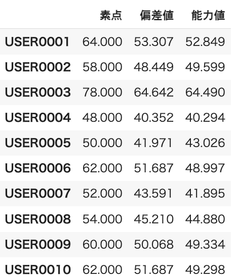
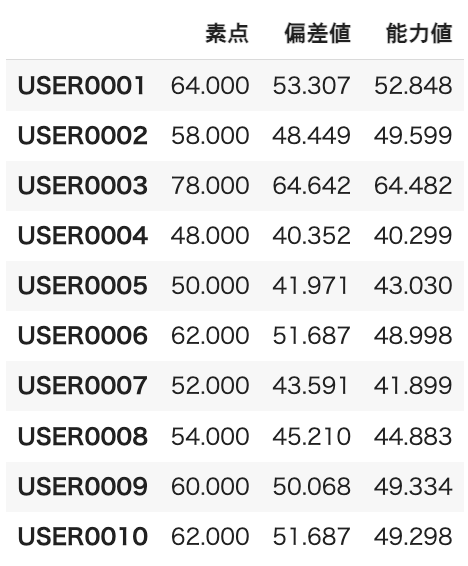

### 正誤訂正

#### 第1版第1刷
|章  |ページ  |内容　　　　　　　|補足|最終更新日|
|:--|---|:--|:--|:--|
|まえがき|ⅵ|2行目 (誤) 重要なな (正) 重要な||2023-11-27|
|1章|p.2|下から2行目 (誤) 対応がづく (正) 対応がつく||2023-11-27|

#### 第1版1～2刷
|章  |ページ  |内容　　　　　　　|補足|最終更新日|
|:--|---|:--|:--|:--|
|まえがき|v|17行目 (誤) 活用されてるかを含めてを紹介し (正) 活用されているかを含めて紹介し||2023-12-12|
|1章|p.3|下から4行目 (誤) 意味を理解することでなく (正) 意味を理解することではなく||2023-12-12|
|1章|p.19|コード1.11のキャプション (誤) (コード1.3からコード1.6の一部を再掲) (正) (コード1.5、1.6、1.8の一部を再掲)||2023-12-18|
|1章|p.19|コード1.11の7行目 (誤) ``x_samples = samples['prior']['x'].values`` (正) ``x_samples = prior_samples['prior']['x'].values``||2023-12-18|
|2章|p.50|3行目 (誤) に対応して (正) に対応した||2023-12-12|
|4章|p.82|7〜8行目 (修正前)"2.4. Diagnosing Numerical Inference" (修正後) |URLとしてはダブルクオートの内部は不要なのでなくします|2023-12-12|
|5章|p.97|6行目 (誤) なりますが。 (正) なりますが、||2023-12-12|
|5章|p.101|コード5.1.13の最終行 (誤) y_list = norm(x_list, mu_mean, sigma_mean) (正) y_list = norm(x_list, mu_mean1, sigma_mean1)||2023-11-27|
|5章|p.102|2行目 (誤) mu_meanとsigma_mean (正) mu_mean1とsigma_mean1||2023-11-27|
|5章|p.103|コード5.1.15の2行目 (誤) X_less = x_result[:5] (正) X_less = X[:5]||2023-11-27|
|6章|p.209|コード6.3.12の13行目 (誤) x1 = summary_theta1['mean'].values (正) x1 = summary_theta1['mean']|紙面の実装だと16行目の計算が標本標準偏差になってしまうため修正|2023-12-12|
|6章|p.209|コード6.3.12の18行目 (誤) df_sum1['能力値'] = x1 (正) df_sum1['能力値'] = x1.values|紙面の実装だと16行目の計算が標本標準偏差になってしまうため修正|2023-12-12|
|6章|p.209|実行結果 (コード修正前)  (コード修正後) 　|能力値の列の値が上記コード修正に伴い多少変化します|2023-12-12|
|6章|p.211|コード6.3.15の下から2行目 (出版時) w3 = (w1 * b_mean1).sum(axis=1)/w2[0] (現在) w3 = (w1 * b_mean1).sum(axis=1)/w2.iloc[0]|pandasのバージョンが上がるとワーニングが出ることがわかっているので、バージョンアップに備えて事前にコードを修正|2023-12-12|

[メインページに戻る](../README.md)
