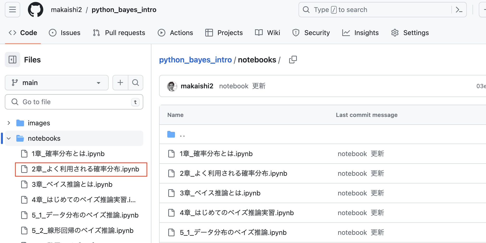
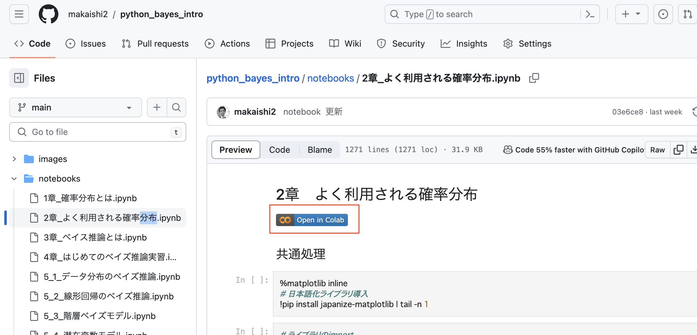
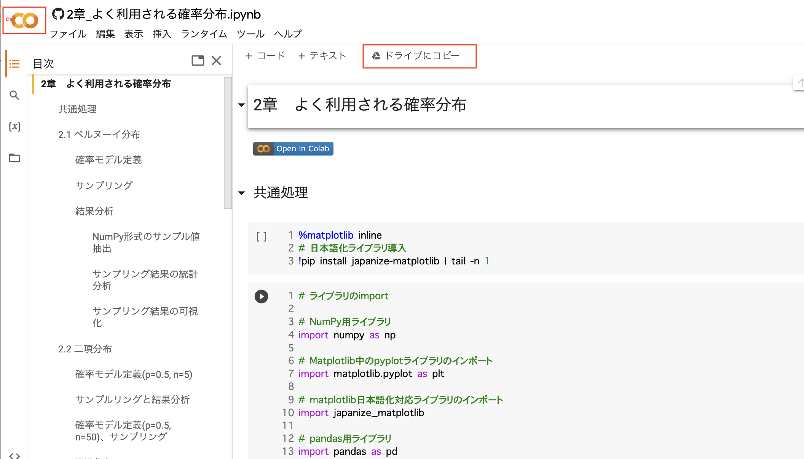
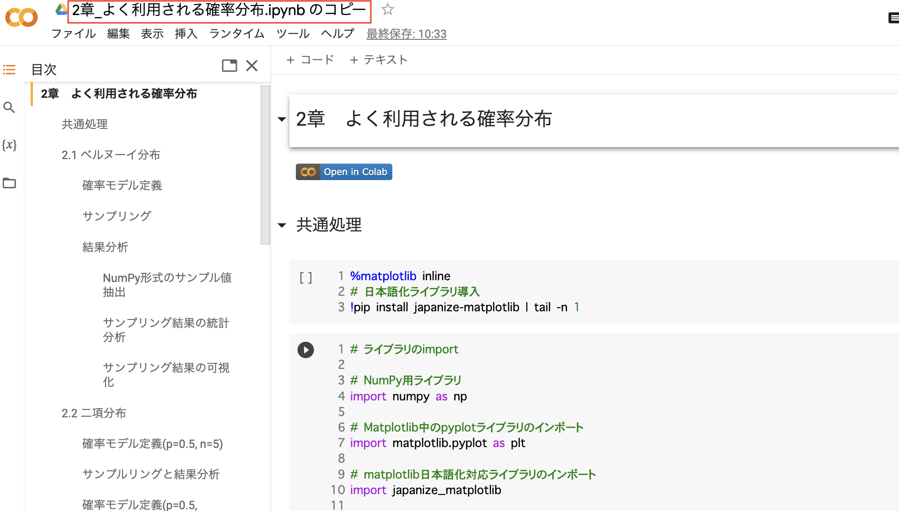

## 実習Notebookの動かし方

**前提**  
Gmailアドレスを事前に取得し、別タブでGmailにログインした状態にします。

### 1. notebook一覧の表示

以下のリンクをクリックしてNotebook一覧を表示します。  

[Notebook一覧](../notebooks/)

 

コントロールキーを押しながらリンクをクリックすると別タブで開くことができます。 

### 2. 実行したいnotebookの選択

左のリストから実行したいnotebookのリンクをダブルクリックします。  
 以下では「2章_よく利用される確率分布.ipynb」を選択しています。 

 

### 3.   Google Colabの起動

画面右上のGoogle Colabアイコンをクリックします。 

 
画面左上に8の数字を横にしたアイコンが表示されていれば、すでにGoogle Colabが使える状態です。
 

### 4. notebookのコピー

ただ、このままでは更新したNotebookを保存できないので、Notebookを自分のホームディレクトリにコピーします。 
そのためには、画面右上の「ドライブにコピー」をクリックして下さい。 

 

### 5. notebookの 実行

画面上部のファイル名が「xxx.ipynbのコピー」となっていれば、ホームディレクトリへのコピーが完了しています。 

 

　この状態で、「Shift + Enter」(Shift を押しながら Enter を押す)を入力すると、選択されたセルが 実行されます。あるいは、メニューから「ラインタイム」「すべてのセルを実行」をクリックすると、すべてのセルを同時に実行することもできます。

[メインページに戻る](../README.md)
